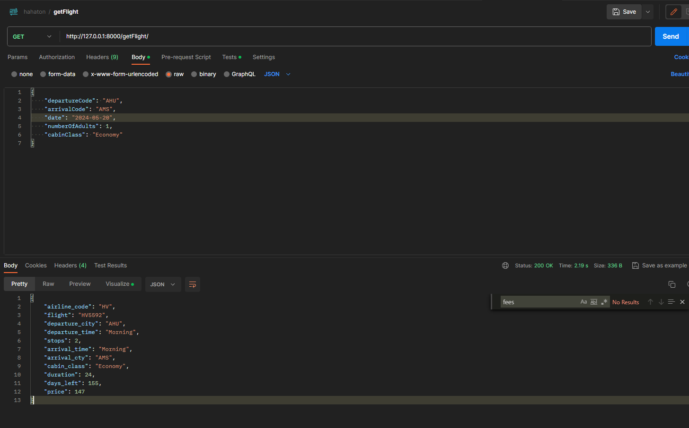

#Бэкэнд микросервиса поиска/предсказания цены на авиабилеты

**requirements:**
- fastapi
- pydantic
- sqlite3
- uvicorn
- scikit-learn
- python-dotenv
- pickle
- joblib
- pandas

*Налажено:*
1. Взаимодействие с БД
2. Взаимодействие с внешним API
3. Получение всей необходимой информации через эндпоинт

`getFlight/`

`body:
{
    "departureCode": "AHU",
    "arrivalCode": "AMS",
    "date": "2024-05-20",
    "numberOfAdults": 1,
    "cabinClass": "Economy"
}`

Пример запроса через Postman:

*План:*
- Resolve имя аэропорта - название города (через таблицу Cities)
- Инициализация модели на бэкэнде (пока на этом встали)

*Структура будущего эндпоинта:*
`predictPrice/`

`body:
{
  "airline": "Air_India",
  "flight": "AI-765",
  "source_city": "Kolkata",
  "departure_time": "Evening",
  "stop": "one",
  "arrival_time": "Night",
  "destination_city": "Delhi",
  "class_flight": "Business",
  "duration": 28.25,
  "days_left": 2
}`
